<h1 align="center">
  <br>
  <a href=""></a>
  <br>

  <br>
</h1>

# Awesome Weather App

[![License: MIT][license_badge]][license_link]

---

A minimal Weather viewer app made with <a href="https://flutter.dev" target="_blank">Flutter</a>.

> because `WeatherStack` API doesn't provide many of the functionality in free plan, for example `weather forecast`, `min temp`, `max temp`, geolocation, some other api providers have been used along WeatherStack to provide full functionality.

also, `there's a release-build version of the app uploaded for android.`
you can find a video recording of the working app in the following links:

Install the App directly:

- <a href="https://drive.google.com/file/d/18DBMBZbBe21gLx_QJkmZ_OWaFv_zecax/view?usp=sharing" target="_blank">Link to Production APK in Google Drive</a>

- <a href="https://drive.google.com/file/d/1SkFPRlIQIT3JG_CEThMrUQCqso8QLYMT/view?usp=sharing" target="_blank">Video Recording</a>

`https://drive.google.com/file/d/18DBMBZbBe21gLx_QJkmZ_OWaFv_zecax/view?usp=sharing`

## Table of Content

- [Key Features](#key-features)
  - [API Logger](#api-logger)
- [How To Use](#how-to-use)
- [Introduction](#introduction)
  - [Architecture](#architecture)
    - [Core](#core)
    - [Features](#features)
      - [Data](#data)
      - [Domain](#domain)
      - [Presentation](#presentation)
  - [Technical Choices](#technical-choices)
    - [Packages and Plugins](#packages-and-plugins)

## Key Features

- Easily Fetch and view Weather of cities using multiple weather API providers:
  - <a href="https://weatherstack.com/documentation" target="_blank">WeatherStack</a>
  - <a href="https://openweathermap.org/api" target="_blank">OpenWeather</a>
  - <a href="https://docs.mapbox.com/" target="_blank">MapBox</a>
- Weather details and information.
- use Map to navigate and get weather of a particular location.

## [](https://drive.google.com/file/d/1SkFPRlIQIT3JG_CEThMrUQCqso8QLYMT/view?usp=sharing)

<table>
  <tr>
    <td>
        <h5>Map with city Search</h5>
    </td>
    <td>
        <h5>City/Location Search</h5>
    </td>    
    <td>
        <h5>Weather Detail (WeatherStack)</h5>
    </td>
    <td>
        <h5>Weather forecast (OpenWeather)</h5>
    </td>      
   </tr>

  <tr>
    <td> 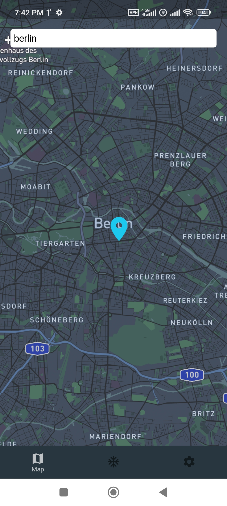</td>
    <td> 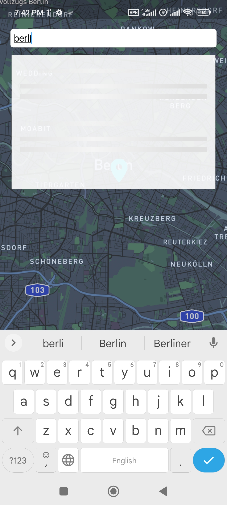</td>
    <td> 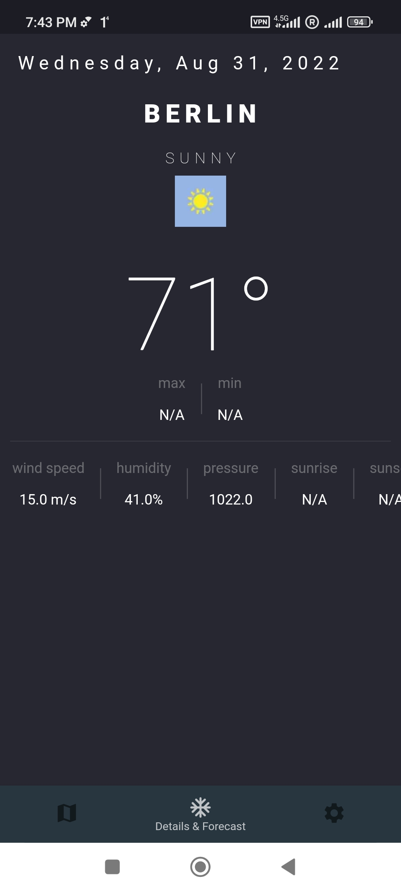</td> 
    <td> 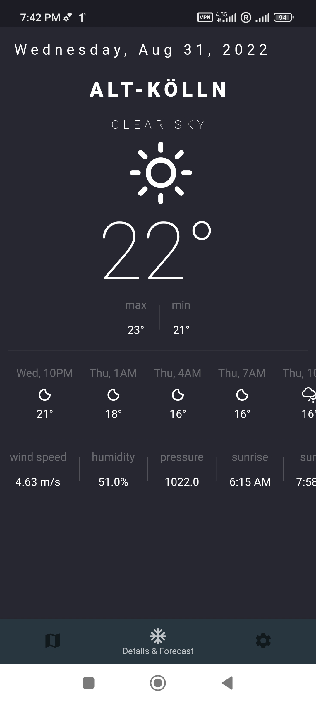</td>   
   </tr>

  <tr>
    <td>
        <h5>Weather Unit (C/F/K)</h5>
    </td>
    <td>
        <h5>Change API provider</h5>
    </td>    
    <td>
        <h5>Weather detail loading</h5>
    </td>
    <td>
        <h5>App Setting</h5>
    </td>      
   </tr>

   <tr>
    <td> 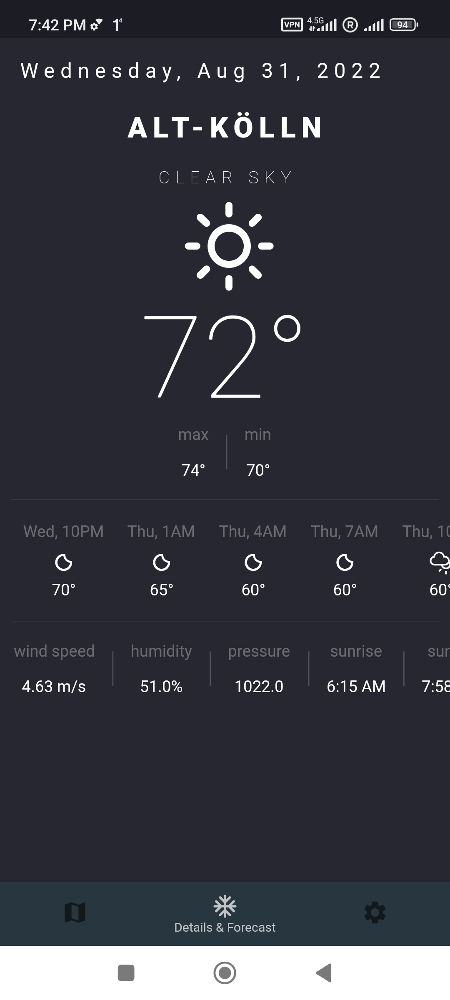</td>
    <td> 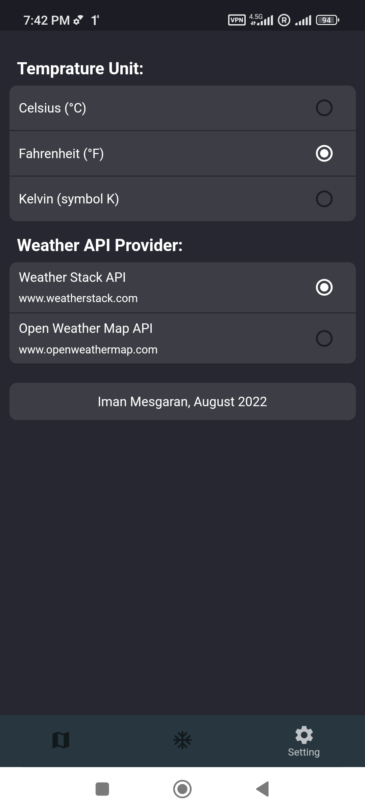</td>
    <td> 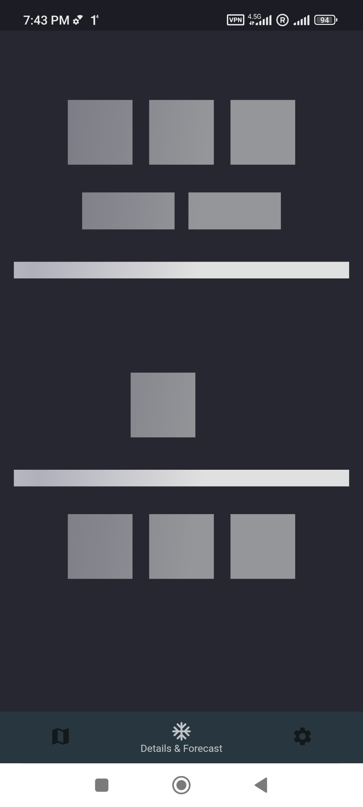</td>
    <td> 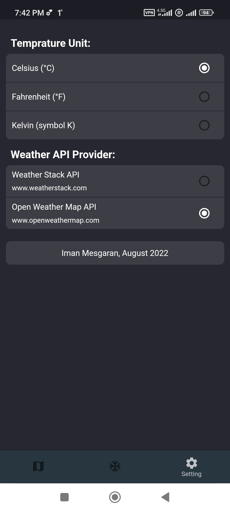</td>  
    </td>
  </tr>

  <tr>
    <td>
        <h5>Weather error widget</h5>
    </td>
    <td>
        <h5>City search error widget</h5>
    </td>    
    <td>
        <h5>Weather initial data</h5>
    </td>  
   </tr>

  <tr>
    <td> 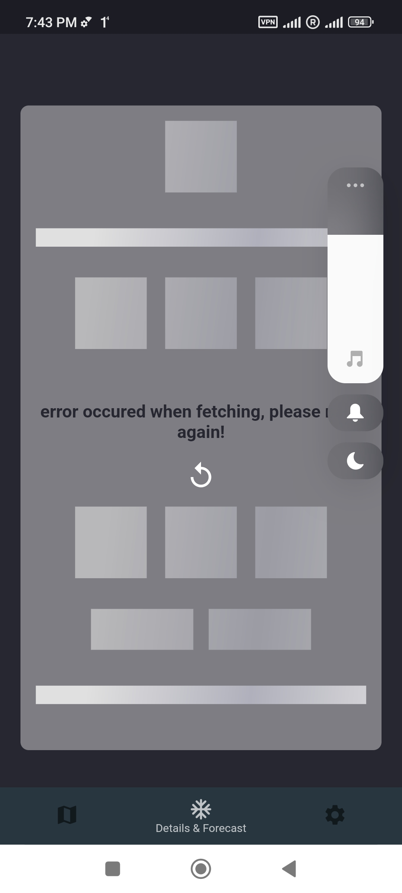</td>
    <td> 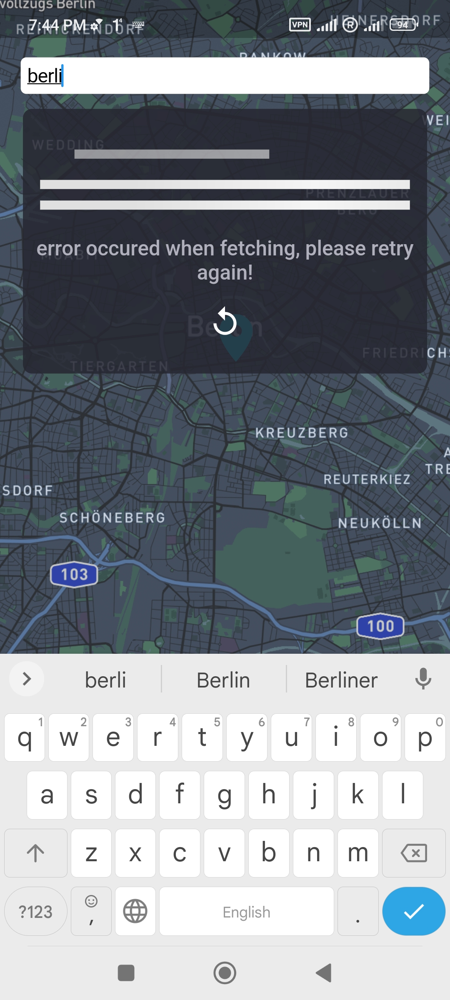</td>
    <td> 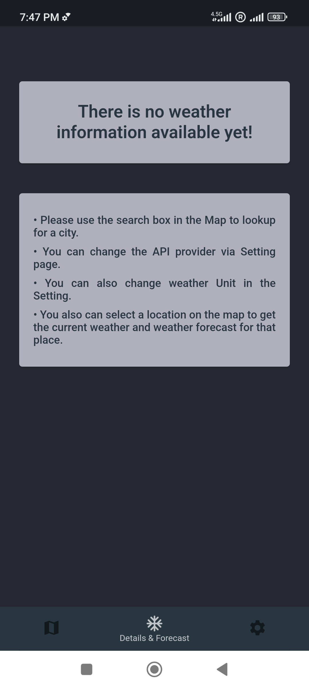</td>
  </tr>
</table>

## Getting Started 🚀

This project contains 3 flavors:

- development
- staging
- production

To run the desired flavor either use the launch configuration in VSCode/Android Studio or use the following commands:

```sh
# Development
$ flutter run --flavor development --target lib/main_development.dart

# Staging
$ flutter run --flavor staging --target lib/main_staging.dart

# Production
$ flutter run --flavor production --target lib/main_production.dart
```

_\*Awesome Weather App works on iOS, Android, Web, and Windows._

---

## How To Use

To clone and run this application, you'll need [Git](https://git-scm.com) and [Flutter](https://flutter.dev/docs/get-started/install) installed on your computer. From your command line:

```bash
# Clone this repository
$ git clone https://github.com/ImanMesgaran/awesome_weather.git

# Go into the repository
$ cd awesome_weather

# Install dependencies
$ flutter packages get

# Run the app
$ flutter run
```

in rare cases, if dart analysis show errors in "Problems" console, you can run and debug the app without any issue.
but to make the fake errors go away, you should restart dart analysis server:
On Mac:
"command" + "shift + "p" => Dart: Restart Analysis Server

## Introduction

the purpose of this code is to demonstrate how to work and interact with provided WeatherStack.com & OpenWeatherMap.org API's using "awesome weather" app written in Dart & Flutter, following Clean-Architecture & TDD approach.

this repository also use MapBox.com API to provide map functionality.

### Architecture


as demonstrated by Clean Architecture approach guild-lines and Instructions:

> Keeping the code clean and tested are the two most important development practices. In Flutter, this is even more true than with other frameworks. On one hand, it's nice to hack a quick app together, on the other hand, larger projects start falling apart when we mix the business logic everywhere. Even state management patterns like BLoC are not sufficient in themselves to allow for easily extendable codebase.

> we should all strive to separate code into independent layers and depend on abstractions instead of concrete implementations.


#### Core

core folder, contains all parts of the code that can be reused throughout the code base and the project. things like Colors, Text-Styles, helper & static classes and Utils, Widgets ,and Networking base classes and interceptors.


#### Features

each separate and major functionality of the app, should be fold and interact in it's own Feature which is divide into 3 layers, presentation, domain and data.

currently, there is only one feature to the app which is `Weather` functionality:


##### Presentation

> This is the stuff we're used to from "unclean" Flutter architecture. we obviously need widgets to display something on the screen. These widgets then dispatch events to the Bloc and listen for states (or an equivalent if you don't use Bloc for state management).

<p float="left">
  <center></center>
</p>

##### Domain

> Domain is the inner layer which shouldn't be susceptible to the whims of changing data sources. It will contain only the core business logic (use cases) and business objects (entities). It should be totally independent of every other layer.

<p float="left">
  <center></center>
</p>

##### Data

> The data layer consists of a Repository implementation (the contract comes from the domain layer) and data sources - one is usually for getting remote (API) data and the other for caching that data.

<p float="left">
<center></center>
</p>

### Technical Choices

### Packages and Plugins

- **_rxdart_**: Reactive-Extension plugin for Dart.

```
_searchQueryController
        .distinct()
        .debounceTime(Duration(milliseconds: 500))
        .switchMap((value) async* {
      yield await getPlaces.call(query: query, provider: apiProvider);
    })
```

- **_get_it_**: this is a simple package to use for Dependency Injection.

  things like Services, Bloc's, and use-cases are available in the code base through DI:

  ```
  import '../../../../injection_container.dart' as di;

  // * Data Sources
  // ! Weather DataSources
  getIt.registerLazySingleton<WeatherRemoteDataSource>(
    () => WeatherRemoteDataSourceImpl(
      client: getIt(),
    ),
  );

  ```

  these are declared in `injection_container.dart` file.

- **_flutter_bloc:_** for the purpose of clarity and using best Patterns & Practices, also because of prior experience, the BLoC library is used in this app.

  ```
  getIt.registerFactory(
    () => WeatherCubit(
      getPlaces: getIt(),
      getCurrentWeatherDetails: getIt(),
      getForecastWeatherDetails: getIt(),
    ),
  );

  // * Use Cases
  // ! Weather Cubit UseCases
  getIt.registerLazySingleton(() => GetPlaces(getIt()));
  getIt.registerLazySingleton(() => GetCurrentWeatherDetails(getIt()));
  getIt.registerLazySingleton(() => GetForecastWeatherDetails(getIt()));

  ```

- **_dartz:_** for using Functional Programming goodies in the app.

  ```
  class GetCurrentWeatherDetails {
  final WeatherRepository repository;

  GetCurrentWeatherDetails(this.repository);
  Future<Either<Failure, WeatherEntity?>> call({
    required LatLng latLng,
    required WeatherAPIProviders provider,
  }) async {
    var result = await repository.getCurrentWeatherDetails(
      latLng: latLng,
      provider: provider,
    );
    return result;
  }
  }
  ```

- **_dio:_** currently, the best plugin for network api connection for flutter with lots of out-of-the-box tools and features.

- **_retrofit:_** dio client generator.

- **_freezed:_** code generator for data-classes/unions/pattern-matching/cloning.

- **_flutter_map:_** map provider for flutter.

---

## Working with Translations 🌐

This project relies on [flutter_localizations][flutter_localizations_link] and follows the [official internationalization guide for Flutter][internationalization_link].

### Adding Strings

1. To add a new localizable string, open the `app_en.arb` file at `lib/l10n/arb/app_en.arb`.

```arb
{
    "@@locale": "en",
    "weatherAppBarTitle": "Weather Viewer",
    "@weatherAppBarTitle": {
        "description": "Text shown in the AppBar of the Weather Viewer Page"
    }
}
```

2. Then add a new key/value and description

```arb
{
    "@@locale": "en",
    "weatherAppBarTitle": "WeatherViewer",
    "@weatherAppBarTitle": {
        "description": "Text shown in the AppBar of the Weather Viewer Page"
    },
    "helloWorld": "Hello World",
    "@helloWorld": {
        "description": "Hello World Text"
    }
}
```

3. Use the new string

```dart
import 'package:awesome_weather/l10n/l10n.dart';

@override
Widget build(BuildContext context) {
  final l10n = context.l10n;
  return Text(l10n.helloWorld);
}
```

### Adding Supported Locales

Update the `CFBundleLocalizations` array in the `Info.plist` at `ios/Runner/Info.plist` to include the new locale.

```xml
    ...

    <key>CFBundleLocalizations</key>
	<array>
		<string>en</string>
		<string>es</string>
	</array>

    ...
```

### Adding Translations

1. For each supported locale, add a new ARB file in `lib/l10n/arb`.

```
├── l10n
│   ├── arb
│   │   ├── app_en.arb
│   │   └── app_es.arb
```

2. Add the translated strings to each `.arb` file:

`app_en.arb`

```arb
{
    "@@locale": "en",
    "weatherAppBarTitle": "Weather Viewer",
    "@weatherAppBarTitle": {
        "description": "Text shown in the AppBar of the Weather Viewer Page"
    }
}
```

`app_es.arb`

```arb
{
    "@@locale": "es",
    "weatherAppBarTitle": "Weather Viewer",
    "@weatherAppBarTitle": {
        "description": "Texto mostrado en la AppBar de la página del"
    }
}
```

[coverage_badge]: coverage_badge.svg
[flutter_localizations_link]: https://api.flutter.dev/flutter/flutter_localizations/flutter_localizations-library.html
[internationalization_link]: https://flutter.dev/docs/development/accessibility-and-localization/internationalization
[license_badge]: https://img.shields.io/badge/license-MIT-blue.svg
[license_link]: https://opensource.org/licenses/MIT
[very_good_analysis_badge]: https://img.shields.io/badge/style-very_good_analysis-B22C89.svg
[very_good_analysis_link]: https://pub.dev/packages/very_good_analysis
[very_good_cli_link]: https://github.com/VeryGoodOpenSource/very_good_cli
